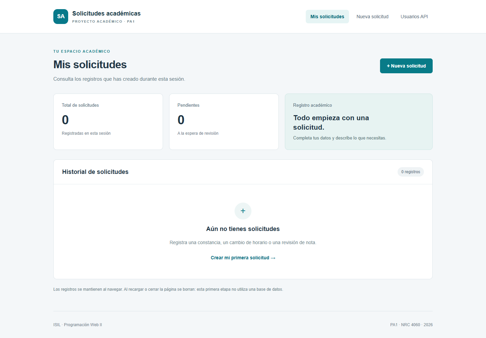
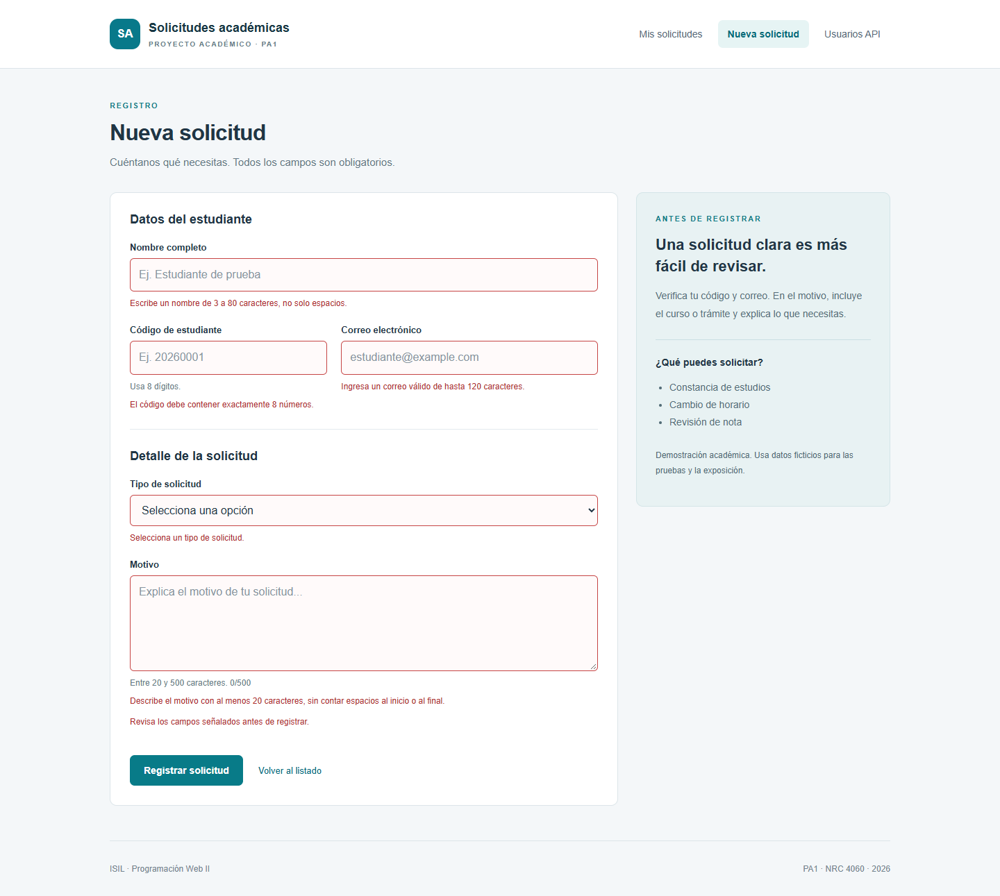
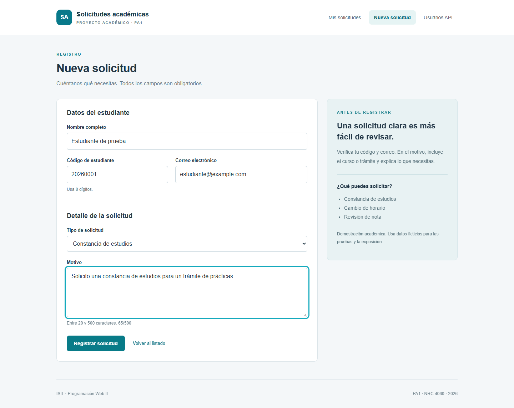
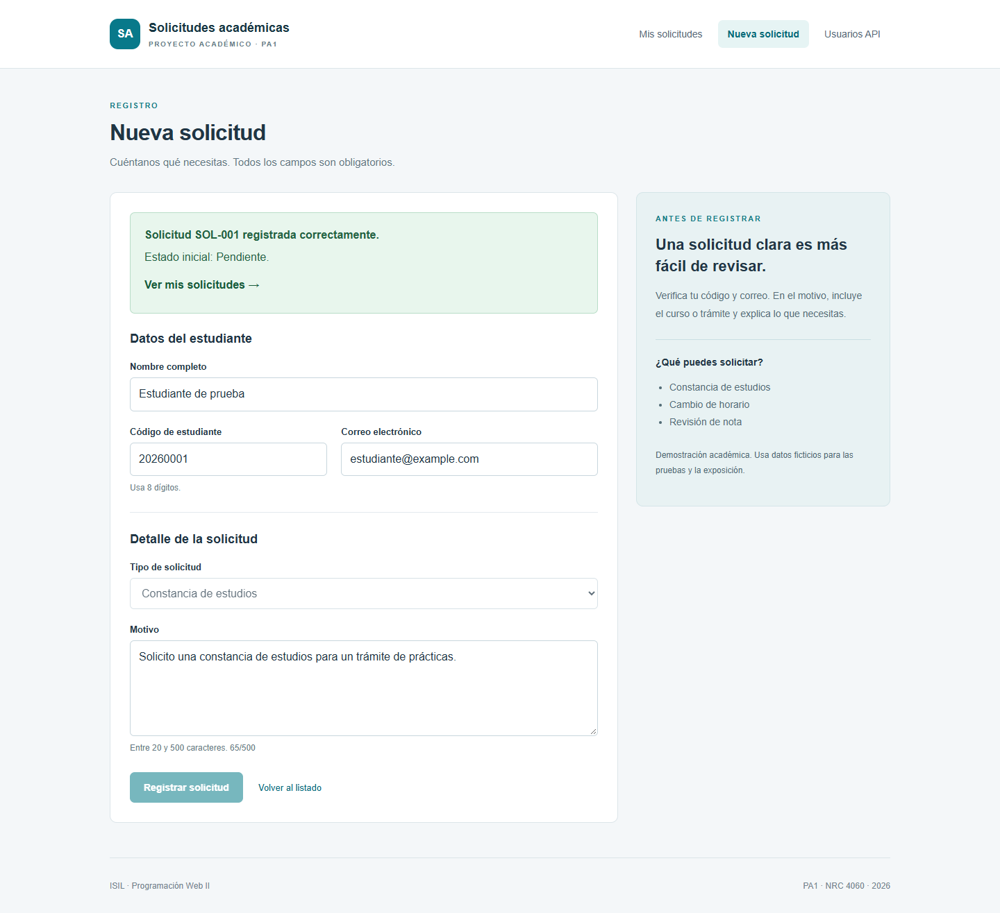
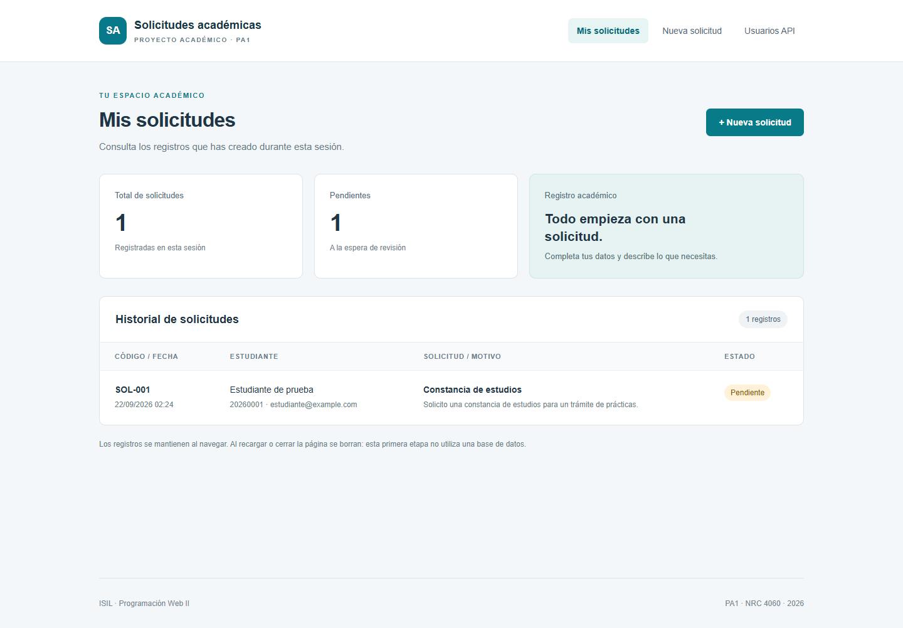
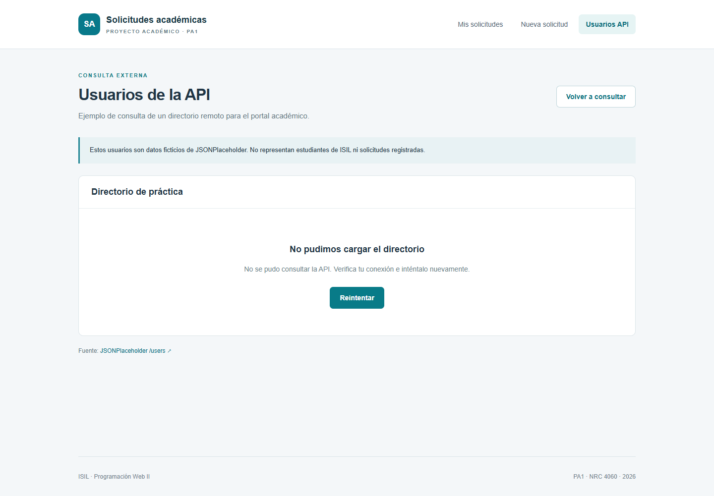
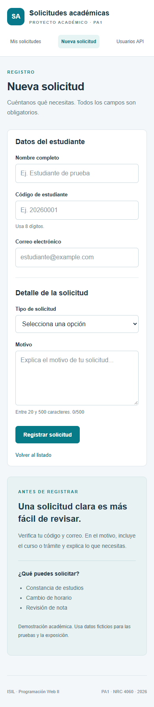
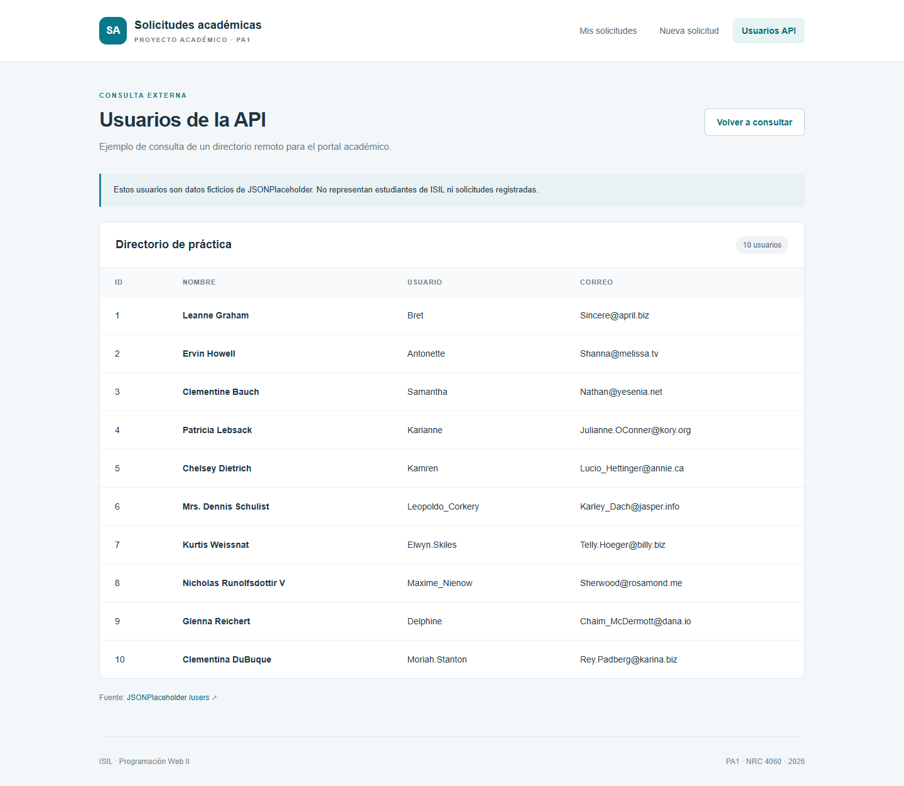

# PA1 - Plataforma de Gestión de Solicitudes Académicas

> **Curso:** PROGRAMACIÓN WEB - II  
> **Código:** 30690 - **NRC:** 4060  
> **Evaluación:** PA1  
> **Repositorio GitHub:** [https://github.com/sanprca-dev/PA1-PROGRAMACION-WEB-II](https://github.com/sanprca-dev/PA1-PROGRAMACION-WEB-II)  
> **Equipo:** Paola Gutiérrez Afata, Mariano Valderrama Shuña y Santiago Prado Carrasco

## 1. Integrantes

| Integrante | Rol | Aporte principal |
|---|---|---|
| Paola Gutiérrez Afata | Desarrollador | Actividad 1: base tipada y organización modular |
| Mariano Valderrama Shuña | Desarrollador | Actividad 2: componentes Angular, binding, directivas y servicio compartido |
| Santiago Prado Carrasco | Desarrollador | Actividades 3 y 4: formulario reactivo, validaciones, navegación y consumo de API REST |

## 2. Descripción y objetivo

**Problema:** se necesita registrar solicitudes académicas con datos completos y consultar la información desde una interfaz organizada.

**Objetivo:** desarrollar una aplicación Angular que permita registrar y visualizar solicitudes, aplicando TypeScript, componentes, servicios, formularios reactivos, rutas y consumo de una API REST.

**Solución desarrollada:** la aplicación dispone de tres vistas: Mis solicitudes, Nueva solicitud y Usuarios API. Permite registrar constancias de estudios, cambios de horario y revisiones de nota. Cada registro recibe un identificador, una fecha y el estado inicial Pendiente. El directorio externo muestra usuarios ficticios de JSONPlaceholder.

Las cuatro actividades se organizan de la siguiente manera:

- **Base tipada y modular:** interfaces para los datos, tipos de solicitud y estado, funciones auxiliares e importación y exportación de módulos.
- **Componentes Angular:** cabecera, pie y vistas independientes; interpolación, directivas y un servicio compartido mediante inyección de dependencias.
- **Formulario y navegación:** controles reactivos con validaciones y rutas configuradas mediante RouterModule.
- **API REST:** consulta GET con HttpClient desde un servicio y presentación de los estados de carga, respuesta vacía, éxito y error.

**Alcance:** las solicitudes se mantienen en memoria al cambiar de vista y se eliminan al recargar la página. Esta etapa no incorpora backend ni base de datos. Los datos ingresados en el formulario no se envían a JSONPlaceholder. Las reglas de longitud y formato son decisiones de esta práctica.

## 3. Cómo ejecutar o revisar

**Requisitos:** Node.js 18.20.8, npm y conexión a Internet para instalar dependencias y consultar la API. El proyecto utiliza Angular 16.2.12 y TypeScript 5.1.6.

Desde la carpeta principal del repositorio:

```bash
cd solicitudes-academicas
npm ci
npm start
```

Abrir http://localhost:4200. Mantener la terminal abierta mientras se revisa la aplicación. En PowerShell puede usarse npm.cmd si la ejecución de npm.ps1 está bloqueada.

Para comprobar los tipos y generar la compilación:

```bash
npm run typecheck
npm run build
```

**Pasos de revisión:**

1. Abrir Mis solicitudes y comprobar el listado vacío.
2. Entrar a Nueva solicitud y enviar el formulario vacío: se muestran los campos inválidos.
3. Probar un código con letras, un correo inválido y un motivo corto; no debe crearse un registro.
4. Completar el formulario con los datos ficticios de ejemplo y pulsar Registrar solicitud.
5. Comprobar la confirmación y acceder a Ver mis solicitudes para visualizar el registro con estado Pendiente.
6. Cambiar de vista y regresar: la solicitud se mantiene. Al recargar la página, el listado vuelve a quedar vacío.
7. Abrir Usuarios API y revisar los usuarios obtenidos. En Network del navegador puede comprobarse la petición GET a https://jsonplaceholder.typicode.com/users.
8. Para probar la recuperación, activar temporalmente Offline en Network, volver a consultar, restaurar la conexión y pulsar Reintentar.

**Datos de ejemplo:** nombre Estudiante de prueba; código 20260001; correo estudiante@example.com; tipo Constancia de estudios; motivo: Solicito una constancia de estudios para un trámite de prácticas.

## 4. Evidencias

Las siguientes capturas muestran el funcionamiento de la aplicación con datos ficticios.

### 01. Listado vacío

Vista inicial sin solicitudes registradas.



### 02. Formulario inválido

Mensajes de validación al intentar enviar el formulario vacío.



### 03. Formulario válido

Formulario completado con datos de prueba que cumplen las validaciones.



### 04. Registro confirmado

Confirmación con identificador de solicitud y controles deshabilitados después del registro.



### 05. Listado con registro

Solicitud visible en el historial con estado Pendiente.



### 06. Error de API simulado

Error HTTP 503 provocado durante una prueba para comprobar el mensaje y la opción de reintentar. No corresponde a una caída real atribuida al proveedor.



### 07. Formulario en pantalla móvil

Distribución del formulario en una pantalla de 390 píxeles de ancho.



### 08. Consulta real de la API

Directorio con diez usuarios obtenidos mediante una consulta real a JSONPlaceholder en la ejecución documentada.



## 5. Matriz de participación

La matriz resume la distribución de responsabilidades del equipo por actividad. Las capturas documentan el funcionamiento de la solución; la exposición permite explicar la parte asignada a cada integrante.

| Integrante | Desarrollo | Pruebas | Documentación | Exposición | Evidencia de participación |
|---|---|---|---|---|---|
| Paola Gutiérrez Afata | Base tipada y módulos | Revisión de tipos y estructura | Modelos y recursos ES6+ | Sí: actividad 1 | Exposición de la actividad 1 |
| Mariano Valderrama Shuña | Componentes y servicio compartido | Listado y presentación de datos | Componentes, binding y servicio | Sí: actividad 2 | Exposición de la actividad 2 |
| Santiago Prado Carrasco | Formulario, rutas y API REST | Validaciones, navegación y consulta REST | Formulario, rutas y API | Sí: actividades 3 y 4 | Exposición de las actividades 3 y 4 |

## 6. Video de exposición

**Video público de YouTube:** [PEGAR AQUÍ EL ENLACE]

La exposición comprende el procedimiento, la solución desarrollada y las decisiones de las cuatro actividades, con la participación de los tres integrantes. El enlace se incorporará cuando el video esté publicado.

## 7. Conclusiones

- TypeScript permite definir una estructura común para las solicitudes y detectar incompatibilidades durante la compilación.
- La separación de componentes y servicios organiza el código y permite compartir los registros entre vistas.
- Los formularios reactivos impiden registrar entradas que no cumplen las validaciones y muestran mensajes para corregirlas.
- RouterModule permite navegar entre las vistas y HttpClient permite consultar información externa desde un servicio.
- El alcance de esta etapa es un frontend funcional; la persistencia en un servidor corresponde a una ampliación posterior.

**Última actualización:** 22/09/2026
